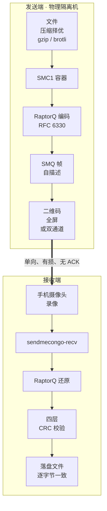

# SendMeCongo

[](https://github.com/BeatoutC/sendmecongo/actions/workflows/ci.yml)
[](#license)

[English](README.md) · 简体中文

**面向物理隔离机器的单向光学文件传输。** 发送端在屏幕上播放喷泉编码的二维码流，
任何手机摄像头都能录下来，一个零依赖的可执行文件就能把文件原样还原——逐字节一致。

零网络、零 USB、零蓝牙。离开这个房间的只有光。



用途：把文档、密钥、配置、日志、小体积证据包**从物理隔离环境里拿出来**——
沿屏幕本来就允许朝向的方向。容器与帧格式见[协议规范](docs/PROTOCOL.md)
（SMQ1 v0.1）。

## 为什么不用现成项目

评估过三个最接近的开源项目：`deedy/qr-data-transfer`（完全没有 LICENSE 文件）、
它的 MIT 标注 fork `qrferry`（继承了无授权的代码）、`decimen-optical-transfer`
（MIT/AGPL 说法冲突，LT 码）。协议思想有借鉴；**没有复用它们任何一行代码**——
本代码库是净室自研、纯 Rust。

## 三个产物

| 产物 | 跑在哪 | 是什么 |
|---|---|---|
| `sendmecongo-send` | 隔离机 | GUI + 全屏播放器，单 exe 双模式 |
| `sendmecongo-recv` | 接收方的机器 | 独立还原工具，**零依赖** |
| `sendmecongo-bench` | 开发机 | 容量标定、帧导出、擦除仿真 |

`sendmecongo-recv` 什么都不用装——不需要 Python、FFmpeg、解码器包、网络。
macOS 构建是 2.6 MB 单架构（arm64）的 `.app`，运行时只依赖系统库
（`otool -L`：CoreFoundation / Cocoa / Metal / libc++ / libSystem）。
它自己解 HEVC / H.264 录像、识别二维码流、重建文件；喷泉码收齐即停，
不需要看完整个录像。

两个 GUI 和命令行都支持**简体中文（默认）/ 繁體中文 / English**——
macOS 从系统菜单栏切换（即时生效），Windows / Linux 用窗口内菜单，
命令行用 `--lang` / `SENDMECONGO_LANG`。

## 快速开始

**发送端**（隔离机）：

```bash
cargo build --release -p sendmecongo-send
./target/release/sendmecongo-send          # GUI：拖文件、选档位、开始播放
```

**接收端**（任意另一台机器，录像拷过去的地方）：

```bash
cargo build --release -p sendmecongo-recv
./target/release/sendmecongo-recv 录像.mov --compare 原文件
```

macOS 上也可以直接双击 DMG 里的 `.app`，把录像拖进窗口。全程可见进度、
已解码帧数、符号数；进度分母来自第一帧的帧头，不是估的。

推荐拍摄配置（实测，非推测）：**turbo60 档、`--size 1600`、4K60 录像、
锁定 AE/AF、手机上支架**。按实测 100 KB/s：1MB ≈ 10 秒、10MB ≈ 1.7 分钟、
64MB ≈ 10 分钟。超过 64MB 直接拒绝——光学链路和准备内存都撑不住。

## 档位与实测吞吐

喷泉码意味着损耗只费时间、不伤正确性：RaptorQ 需要 `K'` 个符号
（比 K 略多，由 RFC 6330 参数决定），流会循环到收齐为止。开销实测 1.00x——
收满 K 个符号、拿回文件、`IDENTICAL`、四层 CRC 端到端验证。

| 档位 | QR | 通道 | sym/s | 标称 | 有效（含 20% 修复符号） |
|---|---|---|---|---|---|
| robust | V15-L | 1 | 10 | 4.9 KB/s | ~4 KB/s |
| balanced | V20-L | 1 | 15 | 12.2 KB/s | ~10 KB/s |
| turbo15 | V30-L | 1 | 15 | 25.0 KB/s | ~21 KB/s |
| turbo30 | V30-L | 1 | 30 | 50.1 KB/s | ~42 KB/s |
| **turbo60** | V30-L | 2 | 60 | 100.2 KB/s | ~84 KB/s |
| megabit | V40-L | 2 | 60 | **171.7 KB/s** | ~143 KB/s |

真实硬件实测（不可压缩随机数据 / iPhone / 锁定 AE/AF / 零黑洞；全部 `IDENTICAL ✓`）：

| 档位 | `--size` | 拍摄 | goodput | 达成率 |
|---|---|---|---|---|
| turbo30 | 1200 | 4K30 | 49.9 KB/s | 99% |
| turbo60 | 1600 | 4K60 | **100.2 KB/s** | 100% |
| megabit | 1400 | 4K30 | 105.2 KB/s | 61% |

实测得出的要点：

- **turbo30 / turbo60 已跑满理论上限**——标称「有效」按含修复符号的完整
  一轮保守计算，实际只需 K 个源符号。
- **turbo60 是推荐默认档**：与 megabit 同吞吐，模块更大（137 vs 177 边长），
  鲁棒性明显更好。
- **双通道档位必须配高帧率拍摄**：相机帧率 ≥ 每 lane 更新率的 2 倍，否则
  相机与 lane 切换的相位拍频会周期性废掉一路（实测 4K30 时 74.6 KB/s、
  `codes/frame` 在 1.0↔2.0 摆动；4K60 回到 100.2 KB/s、稳定 2.0）。
- 擦除仿真（256KB / turbo30 / K=154）：10~40% 丢帧的开销 1.00~1.55x，
  结果始终完好。

## 接收端内部

```
录像.mov/mp4
  ├─ 自研 ISO-BMFF 解封装    hvc1 / hev1 / avc1，moov 在头或尾都行
  ├─ 纯 Rust 解码            HEVC → rusty_h265    H.264 → openh264（vendored，无 cmake）
  ├─ QR 识别                 rxing（ZXing 纯 Rust 移植），只用 QR 一种格式
  ├─ RaptorQ 还原            复用 sendmecongo-core 的 Receiver，协议零改动
  └─ 收齐即停                从不需要看完整个录像
```

录像按 CRA 关键帧（手机 HEVC 里约 0.9 秒一个）切成互相独立的 GOP 多线程并行解码。
GOP 边界是开放式的（其后的 RASL 前导帧会丢）——这正是喷泉码修复符号
存在的意义。

GUI 会列出 app 旁边和常见位置（主目录 / 下载 / 桌面 / 影片 / 外接卷）里
找到的候选录像，按时间从新到旧排；也支持拖进窗口。

## 构建

```bash
cargo build --release            # 全部
```

- 播放**必须**用 release 构建——debug 下渲染跟不上帧率，实测符号率掉一半。
- 工具链由 `rust-toolchain.toml` 钉在 1.98.1（`raptorq 2.0.1` 的 x86 目标
  需要 rustc ≥ 1.89）。
- `sendmecongo-recv` 默认编入 H.264 支持（vendored `openh264` C++，不需要
  cmake；NASM 失败是软失败——没 SIMD 也能用）。没有 C++ 编译器的机器可以
  `--no-default-features` 只留 HEVC——手机实际录的就是 HEVC。
- Windows 构建产出静态 CRT 单文件 exe（见 `.cargo/config.toml`）。
  Windows 的构建步骤、两条独立的图标通路、以及发出前该验什么，
  见 [docs/BUILD-WINDOWS.md](docs/BUILD-WINDOWS.md)。

打包（macOS）：`./tools/build-macos.sh` 产出 `.app` 与 DMG。DMG 里附了
首次打开说明和一键 `清除下载隔离标记.command`——app 是 ad-hoc 签名，下载后
首次打开会被 Gatekeeper 拦（老系统：右键 → 打开；macOS 15+：系统设置 →
隐私与安全性 → 仍要打开；从 U 盘拷过去则没有这个问题）。

## 文档

- [docs/PROTOCOL.md](docs/PROTOCOL.md) —— SMC1 容器与 SMQ 帧格式
- [docs/TESTING.md](docs/TESTING.md) —— 在你自己的屏幕 + 手机上测光学链路，
  以及指标怎么读
- [docs/BUILD-WINDOWS.md](docs/BUILD-WINDOWS.md) —— Windows 构建指南：
  工具链、两条独立的图标通路、验收清单
- [docs/AGENT.md](docs/AGENT.md) —— 机器契约（命令行参数、退出码、JSON Schema），
  给 agent 驱动二进制用

## 已知限制

- macOS 构建只支持 Apple Silicon（有意为之——openh264 交叉编 x86_64 的
  复杂度不值当）。
- 夜览 / 蓝光滤镜导致色偏会毁掉解码，播放前关掉。
- `rxing` 的多码检测偶尔一帧只报出并排两码中的一个；接收端用重叠分带补扫
  缓解，但及格线附近的录像先受影响。
- `rusty_h265` 支持 Main / Main 10 / Main Still Picture、4:2:0、≤10bit——
  正好是手机录像的范围；范围外的会被明确拒绝，不会解出错帧。

## Roadmap

- [ ] H.264 路径端到端实测（现有测试录像全是 HEVC；openh264 分支只过了
      编译与逻辑审查）
- [ ] 打包后的 `.exe` 在真实 Windows 机器上跑一遍
- [ ] megabit 用 `--size 1600` + 4K60 重测（105.2 KB/s 是每码 700px + 4K30，
      还有余量）
- [x] M2（v0.5.0）：断点续传——接收端进度清单跨拍摄合并、逐块符号
      网格、可誊入隔离机的补播码让发送端只播差额——以及 Agent 技能
      （SKILL.md + CLI/JSON 契约），一句提示词即可驱动收发全流程。
      详见 [docs/M2-DESIGN.md](docs/M2-DESIGN.md)
- [ ] M3：AES-256-GCM 加密封封 + 审计日志、多文件批次、验收矩阵自动化

## License

双许可：[MIT](LICENSE-MIT) 或 [Apache-2.0](LICENSE-APACHE)，任选其一——
Rust 生态的默认做法。

---

名字来自 *"send me to the Congo"*：困在隔离墙里的话，这是那条出海的船。
