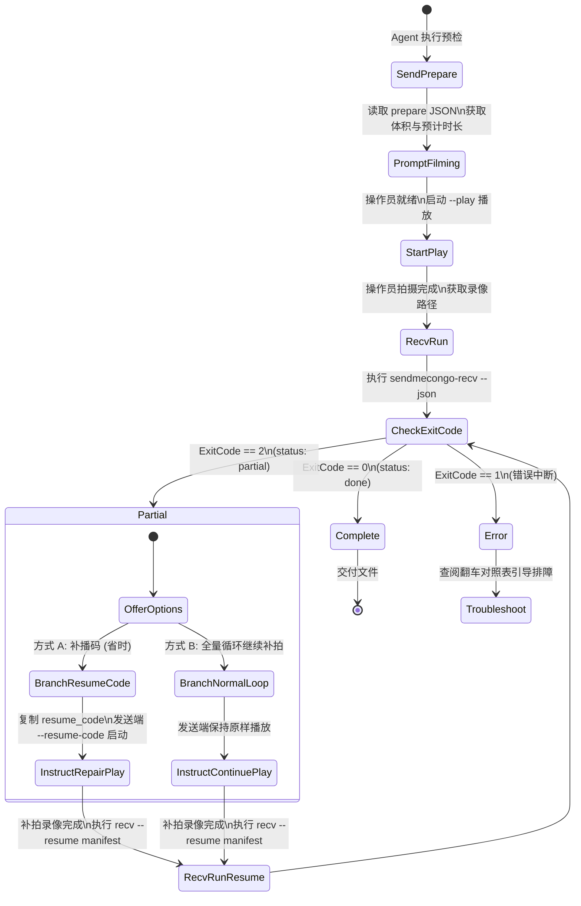

# SendMeCongo Agent 交互契约 (AGENT.md)

本文档定义 AI Agent、自动化脚本或无头服务与 SendMeCongo 二进制程序之间的机器契约，包含命令行参数（CLI Flags）、退出状态码（Exit Codes）、结构化 JSON Schema 及状态机流转逻辑。

---

## 1. 核心设计原则

1. **结构化契约优先**：Agent 与程序交互时，使用 `--json <path>` 输出结构化结果，**仅解析生成的 JSON 文件，严禁依赖 stdout 文本正则**。
2. **退出码语义化**：
   - `0`：成功完成（发送端干跑通过 / 接收端文件完全还原并通过四层校验）。
   - `2`：**部分完成（Partial / 需续传）**。仅接收端可能返回，表明已落盘断点检查点（`.smr.json` 与 `.smr.bin`），需要补拍或合并。
   - `1`：致命错误（参数不符、文件损坏、超过 64MB 限制、无有效帧等）。
3. **播放必须 Release 构建**：Debug 构建的符号吞吐率会下降 90% 以上导致相机解码严重丢帧，Agent 在驱动播放前必须确保程序以 `--release` 编译。

---

## 2. 发送端契约：`sendmecongo-send`

发送端承担文件预检、压缩打包与全屏二维码流式播放。

### 2.1 命令行参数

```bash
sendmecongo-send [FLAGS] [OPTIONS]
```

| 参数 | 类型 | 默认值 | 说明 |
|---|---|---|---|
| `--file <PATH>` / `--in <PATH>` | 路径 | 必填（非 GUI 模式） | 待发送的原文件路径（严格限制 ≤ 64MB） |
| `--preset <NAME>` | 字符串 | `turbo60` | 档位：`robust`, `balanced`, `turbo15`, `turbo30`, `turbo60`, `megabit` |
| `--prepare-only` | 开关 | 否 | **干跑预检模式**：不打开窗口，仅评估压缩率、计算符号数与预估时长 |
| `--play` | 开关 | 否 | **播放模式**：启动全屏二维码流式播放窗口（ESC 键或循环结束退出） |
| `--json <PATH>` | 路径 / `-` | 无 | 输出指标到指定 JSON 文件（传 `-` 则直接输出到 stdout） |
| `--resume-code <CODE>` / `--repair-code <CODE>` | 字符串 | 无 | **补播模式**：传入接收端生成的 SMR1 码，仅播放差额修复符号 |
| `--size <N>` | 整数 | `1600` | 二维码显示窗口尺寸（像素） |
| `--cycles <N>` | 整数 | `0` | 播放完整轮数（`0` 表示无限循环，直到手动按 ESC） |
| `--lanes <N>` | 整数 | 自动（按 preset） | 分屏通道数（1 或 2） |
| `--lang <LANG>` | 字符串 | 自动跟随系统 | 界面/控制台语言：`en`, `zh-Hans`, `zh-Hant` |
| `-h`, `--help` | 开关 | 否 | 查看帮助文档并退出 |

### 2.2 预检模式输出 JSON 规范 (`--prepare-only --json`)

#### 示例
```bash
sendmecongo-send --prepare-only --file testdata/random2m.bin --preset turbo60 --json out/prep.json
```

#### JSON 契约
```json
{
  "tool": "sendmecongo-send",
  "action": "prepare",
  "file": "testdata/random2m.bin",
  "name": "random2m.bin",
  "raw_bytes": 2097152,
  "container_bytes": 1450230,
  "compression": "brotli",
  "session": "a1b2c3d4",
  "preset": "turbo60",
  "symbol_size": 1168,
  "source_symbols": 1242,
  "prepare_secs": 0.352,
  "estimated_seconds": {
    "turbo60": 20.7,
    "turbo30": 41.4,
    "turbo15": 82.8,
    "megabit": 20.7,
    "balanced": 82.8,
    "robust": 124.2
  }
}
```

#### 字段定义
- `file`: 原文件路径
- `raw_bytes`: 原始文件大小（字节）
- `container_bytes`: 经最优压缩封装后的 SMC1 容器字节数
- `compression`: 实际采用的压缩方案（`brotli`、`gzip` 或 `未压缩`）
- `session`: 容器的 CRC-32 校验字（十六进制，8 字符），在传输全生命周期内作为合并键
- `symbol_size`: 当前档位的单符号载荷字节数
- `source_symbols`: 容器被切分后的源符号数（K）
- `prepare_secs`: 读取及压缩封装耗时（秒）
- `estimated_seconds`: 各档位实测/标称符号率下的预计完整拍摄时间（秒）

---

## 3. 接收端契约：`sendmecongo-recv`

接收端承担从手机拍摄视频解析 QR 序列、去重、OTI 提取、RaptorQ 解码、检查点落盘与原文件还原。

### 3.1 命令行参数

```bash
sendmecongo-recv <VIDEO_PATH> [OPTIONS]
```

| 参数 | 类型 | 默认值 | 说明 |
|---|---|---|---|
| `<VIDEO_PATH>` | 路径 | 必填 | 待解析的手机录像文件（.mov / .mp4） |
| `--out <DIR>` | 路径 | 录像同级目录 | 恢复出的原文件输出目录 |
| `--json <PATH>` | 路径 | 无 | **结构化结果落盘路径**（完成或部分均写入） |
| `--resume <MANIFEST>` | 路径（可多次指定） | 无 | **断点续传检查点**：传入先前录像落盘的 `.smr.json` 索引文件 |
| `--compare <ORIGINAL>` | 路径 | 无 | 用于自动化比对验证的原文件路径 |
| `--threads <N>` | 整数 | CPU 核心数 | 视频解码与扫码并发工作线程数 |
| `--quiet`, `-q` | 开关 | 否 | 静默模式（不向终端打印动态进度条） |
| `--dump <PATH>` | 路径 | 无 | 导出提取到的全部唯一符号原始帧序列 |
| `--gui` | 开关 | 否 | 显式启动 egui 图形界面 |

### 3.2 退出状态码契约

- **`0` (Success)**：已收齐足够数量的独立符号（$K' \ge K$），成功还原原文件，四层校验（QR EC $\to$ 帧 CRC-16 $\to$ 符号 RaptorQ $\to$ 容器 CRC-32）全部通过。
- **`2` (Partial)**：未收齐足够的独立符号，但已提取到有效帧并保存了断点检查点（在录像同级生成同名 `<录像>.smr.json` 与 `<录像>.smr.bin`）。
- **`1` (Failure)**：无法打开视频、没有识别到任何合法 SMQ1 帧、容器校验不匹配等严重异常。

### 3.3 接收完成输出 JSON (`status: "done"`, 退出码 0)

```json
{
  "tool": "sendmecongo-recv",
  "status": "done",
  "result": "COMPLETE",
  "received_file": "/path/to/recv/random2m.bin",
  "input": "recordings/08.MOV",
  "output": "/path/to/recv/random2m.bin  (2.00 MB)",
  "bytes": 2097152,
  "frames_decoded": 2770,
  "codes_found": 5542,
  "symbols_received": 1893,
  "unique_symbols": 1231,
  "duplicate_symbols": 662,
  "rejected_symbols": 4,
  "decode_errors": 0,
  "gops": 46,
  "symbol_size": 1710,
  "object_len": 2097152,
  "source_symbols": 1227,
  "elapsed_sec": 64.6,
  "throughput_bytes_per_sec": 32464.0,
  "identical": true
}
```

### 3.4 接收部分完成输出 JSON (`status: "partial"`, 退出码 2)

```json
{
  "tool": "sendmecongo-recv",
  "status": "partial",
  "result": "PARTIAL",
  "received_file": null,
  "resume_code": "SMR1-B42A-MQQC-N4EA-AAAA-K",
  "input": "recordings/06.MOV",
  "progress": {
    "session": "a1b2c3d4",
    "object_len": 2097152,
    "symbol_size": 1710,
    "received": 1229,
    "source_symbols": 1227,
    "needed_estimate": 8,
    "manifest": "recordings/06.smr.json",
    "eta_seconds": {
      "turbo60": 1,
      "turbo30": 1,
      "turbo15": 1,
      "megabit": 1
    }
  },
  "frames_decoded": 2770,
  "codes_found": 2458,
  "symbols_received": 2458,
  "rejected_symbols": 0,
  "decode_errors": 0,
  "elapsed_sec": 42.1
}
```

#### 关键字段与 Agent 行为指导：
- `status`: `"partial"`，表示当前批次并未收齐。
- `resume_code`: 紧凑补播码（SMR1 base32），Agent 可将此代码呈现给操作员，指导发送端只补播这部分。
- `progress.needed_estimate`: 还差的估计符号数（已包含 5% RaptorQ 冗余及兜底）。
- `progress.manifest`: 检查点清单路径。下次录制后执行合并时，需将此路径传给 `--resume`。
- `progress.eta_seconds`: 各档位补齐所需预估拍摄秒数。

---

## 4. Agent 驱动续传完整状态机



### 续传调用示例
1. **第 1 次接收（录像 06.MOV 欠收）**：
   ```bash
   sendmecongo-recv recordings/06.MOV --json out/06.json
   # 退出码为 2，out/06.json 指示 manifest="recordings/06.smr.json", resume_code="SMR1-..."
   ```
2. **第 2 次补播（可选：发送端补播）**：
   ```bash
   sendmecongo-send --file testdata/random2m.bin --resume-code "SMR1-..." --play
   ```
3. **第 2 次接收（合并检查点）**：
   ```bash
   sendmecongo-recv recordings/07.MOV --resume recordings/06.smr.json --json out/07.json
   # 退出码为 0，out/07.json 指示 status="done", received_file="/path/to/recovered"
   ```

